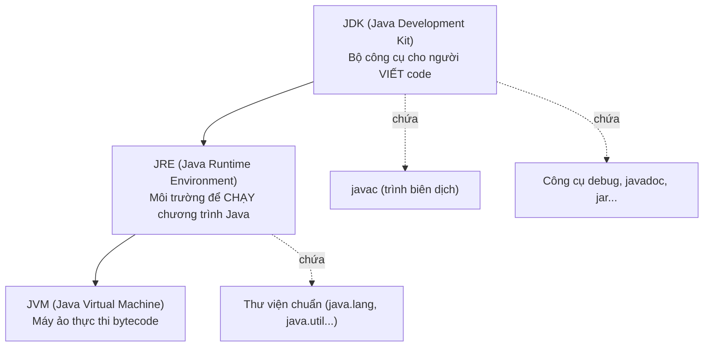
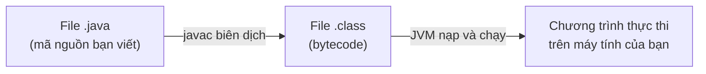

# Chương 1 — Giới thiệu Java: JDK/JRE/JVM là gì

## Mục tiêu học

Sau chương này, bạn sẽ:

- Biết Java là gì, dùng để làm gì, và vì sao nó vẫn là một trong những ngôn ngữ phổ biến nhất
  sau gần 30 năm.
- Phân biệt rõ ràng ba khái niệm hay bị nhầm lẫn: **JVM**, **JDK**, **JRE**.
- Hiểu cơ chế "viết một lần, chạy mọi nơi" (write once, run anywhere) hoạt động thế nào.
- Biết cách chọn phiên bản Java nào để học (bản LTS là gì, vì sao chương này chọn Java 21).

Chương này **không có code** — đây là chương nền tảng khái niệm. Từ Chương 3 bạn sẽ viết và chạy
chương trình Java đầu tiên.

## Java là gì?

Java là một ngôn ngữ lập trình **hướng đối tượng** (object-oriented), ra đời năm 1995 bởi Sun
Microsystems (nay thuộc Oracle). Java được dùng để viết:

- Ứng dụng doanh nghiệp (backend server, hệ thống ngân hàng, bảo hiểm...) — phần lớn hệ thống lớn
  ở các công ty vẫn chạy Java.
- Ứng dụng Android (Android SDK dùng Java/Kotlin làm ngôn ngữ chính).
- Công cụ, hệ thống lớn (Hadoop, Kafka, Elasticsearch đều viết bằng Java).

Điểm khiến Java tồn tại lâu và được dùng rộng rãi không phải vì cú pháp đẹp, mà vì **tính ổn định,
khả năng chạy đa nền tảng, và hệ sinh thái thư viện khổng lồ**. Đây cũng là lý do sách này chọn Java
làm ngôn ngữ đầu tiên để dạy tư duy hướng đối tượng (OOP): Java buộc bạn viết OOP đúng cách, không
có đường tắt như một số ngôn ngữ khác.

> **Lưu ý quan trọng cho người mới**: Java và JavaScript là **hai ngôn ngữ hoàn toàn khác nhau**,
> không liên quan gì ngoài cái tên. JavaScript chạy trong trình duyệt, dùng cho web frontend; Java
> là ngôn ngữ tổng quát, biên dịch và chạy trên máy ảo riêng của nó (JVM — sẽ giải thích ngay sau
> đây). Đừng nhầm lẫn hai cái này khi tìm tài liệu.

## JVM, JDK, JRE — ba khái niệm nền tảng

Đây là câu hỏi gần như 100% người mới học Java sẽ bị rối ở tuần đầu tiên. Hãy hình dung theo lớp
từ trong ra ngoài:

- **JVM (Java Virtual Machine)** — máy ảo thực thi. Đây là chương trình đọc và chạy **bytecode**
  (file `.class`) — không chạy trực tiếp mã nguồn `.java`. Mỗi hệ điều hành (Windows, macOS, Linux)
  có một bản JVM riêng, nhưng bytecode thì giống hệt nhau trên mọi nền tảng. Đây chính là cơ chế
  "viết một lần, chạy mọi nơi": bạn biên dịch code Java **một lần**, ra file `.class` chứa bytecode,
  rồi file đó chạy được trên bất kỳ máy nào có JVM — không cần biên dịch lại.
- **JRE (Java Runtime Environment)** — JVM cộng thêm các thư viện chuẩn cần thiết để **chạy** một
  chương trình Java đã biên dịch sẵn. Nếu máy bạn chỉ cần *chạy* ứng dụng Java (không viết code),
  về lý thuyết chỉ cần JRE là đủ.
- **JDK (Java Development Kit)** — JRE cộng thêm các công cụ để **viết và biên dịch** code, quan
  trọng nhất là `javac` (trình biên dịch, dịch file `.java` thành `.class`). JDK là thứ **bạn cần
  cài đặt** để học lập trình Java, vì nó bao gồm cả JRE lẫn JVM bên trong.

Tóm gọn một câu: **JDK ⊃ JRE ⊃ JVM** (JDK chứa JRE, JRE chứa JVM). Từ Java 11 trở đi, Oracle không
còn phát hành JRE độc lập nữa — bạn chỉ cần tải và cài **JDK** là có đủ mọi thứ để vừa viết vừa
chạy code. Chương 2 sẽ hướng dẫn cài đặt cụ thể.

## Quy trình một chương trình Java chạy như thế nào

Khác với ngôn ngữ biên dịch trực tiếp ra mã máy (như C/C++, biên dịch ra file `.exe` chỉ chạy được
trên đúng hệ điều hành đã biên dịch), Java biên dịch ra **bytecode** — một dạng mã trung gian độc
lập hệ điều hành. Chính JVM (khác nhau theo từng OS) mới là thứ chuyển bytecode thành lệnh máy thực
sự tại thời điểm chạy. Đánh đổi: Java thường chạy chậm hơn một chút so với code biên dịch thẳng ra
máy (dù JVM hiện đại có JIT compiler tối ưu hoá rất mạnh), nhưng đổi lại bạn không phải biên dịch
lại code cho từng hệ điều hành.

## Hệ sinh thái Java

- **Java SE (Standard Edition)** — bộ nền tảng cơ bản, dùng cho ứng dụng desktop/console. Đây là
  thứ sách này dạy từ đầu đến cuối.
- **Java EE / Jakarta EE (Enterprise Edition)** — mở rộng cho ứng dụng server/web quy mô lớn
  (không nằm trong phạm vi sách này, nhưng kiến thức OOP + collection + exception trong sách là nền
  tảng bắt buộc trước khi học Jakarta EE hay Spring Framework).
- **Android** — Android SDK dùng Java (và Kotlin) làm ngôn ngữ phát triển ứng dụng chính.
- Các framework phổ biến trong công việc thực tế: **Spring/Spring Boot** (backend web), **Maven**/
  **Gradle** (quản lý build & dependency — sẽ học ở Phần 9), **JUnit** (kiểm thử — Phần 9).

## Phiên bản Java và bản LTS

Java phát hành phiên bản mới mỗi 6 tháng, nhưng không phải bản nào cũng đáng dùng lâu dài. Oracle
đánh dấu một số bản là **LTS (Long-Term Support)** — được hỗ trợ và vá lỗi trong nhiều năm, phù hợp
để học và dùng trong dự án thật. Các bản LTS gần đây: Java 8, 11, 17, 21.

Sách này dùng **Java 21 (LTS)** làm chuẩn cho toàn bộ code mẫu, vì đây là bản LTS mới nhất tại thời
điểm biên soạn, có đầy đủ các tính năng hiện đại sẽ học ở Phần 6 (record, pattern matching, virtual
thread...). Những chương dùng tính năng chỉ có ở Java 21 sẽ ghi chú rõ để bạn biết nếu đang dùng
bản cũ hơn (ví dụ Java 8 hoặc Java 17) thì phần nào không chạy được.

## Bài tập

1. Tự giải thích lại bằng lời của bạn (không nhìn sách): sự khác nhau giữa JDK, JRE, JVM là gì?
   Nếu máy bạn chỉ cài JRE (không có JDK), bạn có viết được code Java không? Vì sao?
2. Tìm hiểu: "bytecode" khác "mã máy" (machine code) ở điểm nào? Vì sao JVM cần tồn tại thay vì
   Java biên dịch thẳng ra mã máy như C?
3. Liệt kê 3 phần mềm hoặc hệ thống bạn biết (hoặc tra cứu) được viết bằng Java.

## Hiểu lầm thường gặp

- **"Cứ cài JRE là học lập trình Java được"** — Sai. JRE chỉ để *chạy* chương trình đã biên dịch
  sẵn, không có `javac` nên không biên dịch được code bạn viết. Phải cài **JDK**.
- **"Java chậm hơn hẳn C/C++ nên không dùng được cho hệ thống lớn"** — Không chính xác trong thực
  tế: JVM hiện đại có JIT (Just-In-Time) compiler tối ưu hoá bytecode thành mã máy ngay khi chạy,
  hiệu năng đủ tốt cho tuyệt đại đa số ứng dụng doanh nghiệp — bằng chứng là các hệ thống lớn như
  LinkedIn, Netflix backend, hay toàn bộ Android đều dựa trên Java/JVM.
- **"Java và JavaScript liên quan đến nhau"** — Không. Tên giống nhau chỉ vì lý do marketing lịch
  sử (JavaScript ra đời sau, mượn tên Java lúc đó đang nổi để dễ tiếp cận), về mặt kỹ thuật hai
  ngôn ngữ không chia sẻ gì cả.
