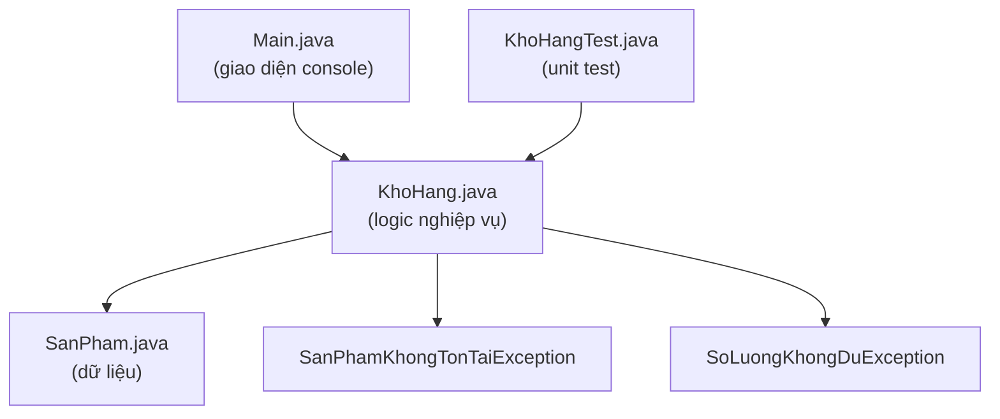

# Chương 47 — Dự án tổng hợp

## Mục tiêu

Đây là chương **thực hành tổng hợp**, không giới thiệu khái niệm mới — mục tiêu là xây dựng một
ứng dụng console hoàn chỉnh, áp dụng lại kiến thức từ Phần 2 đến Phần 10 vào **một dự án thống
nhất**, thay vì các ví dụ nhỏ tách rời từng chương như trước.

Dự án: **Quản lý kho hàng** — thêm/sửa/xoá sản phẩm, nhập/xuất kho, tìm sản phẩm sắp hết hàng, tính
tổng giá trị kho, lưu/đọc dữ liệu giữa các lần chạy, có unit test.

Code đầy đủ: [`code/ch47-du-an-tong-hop/`](../../code/ch47-du-an-tong-hop/) — khuyến khích **tự
mình đọc kỹ toàn bộ 5 file** trước khi đọc phần phân tích dưới đây, cố gắng tự nhận diện các khái
niệm đã học ở từng chỗ.

## Thiết kế tổng thể

Kiến trúc này áp dụng trực tiếp **SRP** (Chương 45): `Main` chỉ lo đọc/hiển thị console, không chứa
logic nghiệp vụ; `KhoHang` chỉ lo logic nghiệp vụ, không biết gì về `Scanner`/`System.out`. Đây
chính là lý do `KhoHangTest.java` viết test được dễ dàng cho `KhoHang` — không cần giả lập bàn
phím/màn hình gì cả (nhắc lại nguyên tắc "thiết kế dễ test" ở Chương 41).

## Đối chiếu từng phần với kiến thức đã học

### `SanPham.java` — Chương 13, 14, 20

Class dữ liệu với field `private`, getter, và setter **có chọn lọc** (`datSoLuong`/`datGia` — có
setter, khác `TaiKhoanNganHang` ở Chương 14 cố tình không có setter cho `soDu`, vì ở đây việc "đặt
lại số lượng" là hành động hợp lệ, khác bản chất bài toán ngân hàng). Override `equals`/`hashCode`
dựa trên `maSanPham` (mã sản phẩm là định danh duy nhất — đúng tinh thần Chương 20: chọn field nào
thực sự xác định "hai object có cùng là một sản phẩm hay không"), và `toString()` định dạng đẹp để
hiển thị console.

### `SanPhamKhongTonTaiException.java`, `SoLuongKhongDuException.java` — Chương 21

Hai checked exception tự định nghĩa, đại diện cho hai tình huống lỗi nghiệp vụ **có thể lường
trước** (thao tác trên mã sản phẩm không tồn tại, xuất kho vượt số lượng tồn) — nhắc lại lý do
chọn checked exception thay vì chỉ in cảnh báo (đã bàn ở Chương 21): buộc `Main` phải **chủ động**
xử lý, không thể "vô tình" bỏ qua.

### `KhoHang.java` — Chương 26, 31, 34, 35, 45

- `Map<String, SanPham>` (cụ thể là `LinkedHashMap`, giữ thứ tự thêm vào — Chương 26) làm cấu trúc
  lưu trữ chính, tra cứu theo mã sản phẩm.
- `timSanPhamSapHet(...)` dùng Stream API (`filter`, `sorted`, `collect` — Chương 31) thay vì vòng
  lặp thủ công.
- `luuRaFile`/`docTuFile` dùng `Files.write`/`Files.readAllLines` (Chương 34), định dạng CSV
  (Chương 35) qua `toCsvLine`/`tuCsvLine` trong `SanPham`.
- Toàn bộ class chỉ đảm nhận **một trách nhiệm**: quản lý dữ liệu và quy tắc nghiệp vụ của kho hàng
  (SRP, Chương 45) — không biết gì về cách dữ liệu được hiển thị hay nhập vào.

### `Main.java` — Chương 5, 7, 21

`Scanner` đọc input (Chương 5), `switch` expression điều hướng menu (Chương 7), `try/catch`
multi-catch xử lý cả hai loại exception nghiệp vụ cùng lúc, cộng thêm `NumberFormatException` khi
người dùng nhập sai định dạng số (Chương 21) — chương trình **không crash** dù người dùng nhập bậy,
luôn quay lại menu để thử tiếp.

### `KhoHangTest.java` — Chương 41

Test cho từng nghiệp vụ cốt lõi: thêm/tìm, nhập kho, xuất kho (cả trường hợp thành công lẫn thất
bại — `assertThrows`), tìm sản phẩm sắp hết, tính tổng giá trị. `@BeforeEach` đảm bảo mỗi test bắt
đầu với một `KhoHang` chứa đúng một sản phẩm mẫu, độc lập hoàn toàn với các test khác.

## Những gì dự án CHƯA áp dụng, và vì sao

Dự án không cố nhồi nhét **mọi** kiến thức đã học — đây là lựa chọn có chủ đích, phản ánh đúng thực
tế: không phải dự án nào cũng cần đa luồng (Chương 37-40), design pattern phức tạp (Chương 44), hay
JDBC (Chương 46). README code mẫu gợi ý một số hướng mở rộng **không bắt buộc** nếu bạn muốn luyện
tập thêm — ví dụ thay lưu trữ CSV bằng JDBC + H2, hoặc thêm Strategy pattern cho quy tắc giảm giá.
**Biết khi nào một kỹ thuật là cần thiết** (thay vì áp dụng máy móc mọi thứ đã học vào mọi dự án)
chính là một phần quan trọng của tư duy kỹ sư phần mềm trưởng thành — nhắc lại đúng tinh thần đã
nhấn mạnh ở Chương 44: không lạm dụng công cụ chỉ vì "biết nó tồn tại".

## Bài tập mở rộng

1. Chạy chương trình, thử toàn bộ các chức năng menu, cố tình nhập sai (chữ thay vì số, mã sản
   phẩm không tồn tại, xuất kho vượt tồn) để xác nhận chương trình xử lý đúng, không crash.
2. Thêm chức năng "sửa thông tin sản phẩm" (đổi tên/giá mà không qua nhập/xuất kho) vào menu.
3. Thêm chức năng "tìm kiếm sản phẩm theo tên" (tìm gần đúng, không cần khớp chính xác — dùng
   `String.contains`, Chương 11) vào `KhoHang` và `Main`.
4. (Nâng cao) Thực hiện một trong các gợi ý mở rộng trong README code mẫu: chuyển lưu trữ sang JDBC
   + H2 (Chương 46), hoặc thêm Strategy pattern (Chương 44) cho quy tắc giảm giá khi xuất kho số
   lượng lớn.
5. Viết thêm test cho các chức năng bạn tự thêm ở bài 2-3, giữ đúng nguyên tắc mỗi test độc lập
   (Chương 41).

Hoàn thành dự án này là cột mốc kết thúc phần thân chính của sách — bạn đã đi từ `System.out.println("Xin chao, Java!")`
ở Chương 3 tới một ứng dụng console hoàn chỉnh có kiến trúc rõ ràng, xử lý lỗi đúng cách, và có
test tự động. Phụ lục A-B (chương tiếp theo) cung cấp tài liệu tra cứu nhanh cho quá trình bạn tiếp
tục thực hành sau khi đọc xong sách.
