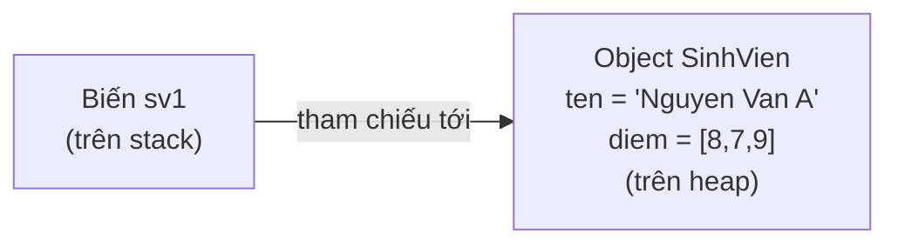

# Chương 13 — Class & Object

## Mục tiêu học

Sau chương này, bạn sẽ:

- Định nghĩa được một class với field và phương thức instance.
- Tạo object từ class bằng `new`, hiểu chuyện gì xảy ra trong bộ nhớ khi làm vậy.
- Viết constructor (kể cả nhiều constructor overload), hiểu khi nào Java tự tạo constructor mặc
  định cho bạn.
- Dùng đúng từ khoá `this`, hiểu vì sao đôi khi bắt buộc phải dùng nó.
- Hiểu `null` là gì — giá trị "chưa trỏ tới object nào" của kiểu tham chiếu.

Code mẫu đầy đủ: [`code/ch13-class-va-object/`](../../code/ch13-class-va-object/).

## Class là khuôn mẫu, Object là thực thể cụ thể

Tiếp nối Chương 12: **class** là bản thiết kế/khuôn mẫu mô tả một loại thứ gì đó có những dữ liệu
gì (field) và làm được những gì (phương thức). **Object** là một thực thể **cụ thể** được tạo ra
từ khuôn mẫu đó, tồn tại thật trong bộ nhớ lúc chương trình chạy.

Ẩn dụ quen thuộc: class `SinhVien` giống như **bản thiết kế nhà** — nó mô tả nhà có mấy phòng, mấy
cửa sổ, nhưng bản thân bản thiết kế không phải là một căn nhà bạn ở được. Mỗi lần bạn `new SinhVien(...)`,
bạn "xây" một **căn nhà cụ thể** theo đúng bản thiết kế đó — có địa chỉ riêng (vị trí trong bộ nhớ),
độc lập hoàn toàn với những căn nhà khác cũng xây từ cùng bản thiết kế.

## Định nghĩa class

```java
public class SinhVien {
    String ten;
    int[] diem;

    public double tinhDiemTrungBinh() {
        int tong = 0;
        for (int d : diem) {
            tong += d;
        }
        return (double) tong / diem.length;
    }
}
```

- `String ten;` và `int[] diem;` là **field** (thuộc tính) — dữ liệu mà **mỗi object** của class
  này sẽ tự mang theo một bản riêng.
- `tinhDiemTrungBinh()` là **phương thức instance** — khác với phương thức `static` học ở Chương
  10, phương thức instance **không có** từ khoá `static`, và luôn thao tác trên dữ liệu của **đúng
  object đang gọi nó** (bên trong thân phương thức, `diem` chính là field `diem` của object gọi
  phương thức này — không phải một biến trôi nổi đâu đó).

## Tạo object với `new`

```java
SinhVien sv1 = new SinhVien();
```

`new SinhVien()` làm hai việc: (1) **cấp phát vùng nhớ mới** trong một khu vực bộ nhớ gọi là
**heap**, đủ chứa các field của `SinhVien`; (2) gọi **constructor** để khởi tạo giá trị ban đầu cho
vùng nhớ đó. Biến `sv1` **không chứa trực tiếp object** — nó chứa một **tham chiếu** (giống địa chỉ)
trỏ tới object vừa tạo trong heap. Đây chính là khái niệm "kiểu tham chiếu" đã nhắc tới khi học mảng
ở Chương 9 — thực ra mảng trong Java **cũng là object**, hoạt động theo đúng cơ chế này.



Hệ quả quan trọng, đúng như đã thấy với mảng: `SinhVien sv2 = sv1;` **không tạo object mới**, chỉ
tạo thêm một biến trỏ tới **cùng** object — sửa qua `sv2` sẽ ảnh hưởng tới những gì `sv1` "thấy",
vì cả hai cùng trỏ tới một chỗ. Muốn hai object thật sự độc lập, phải gọi `new` riêng cho từng cái
(như `sv1` và `sv2` trong code mẫu `Main.java`).

## Constructor

**Constructor** là một khối code đặc biệt chạy **đúng một lần** khi object được tạo bằng `new`,
dùng để thiết lập giá trị ban đầu cho các field.

```java
public SinhVien(String ten, int[] diem) {
    this.ten = ten;
    this.diem = diem;
}
```

Đặc điểm nhận diện constructor: **tên trùng chính xác tên class**, và **không có kiểu trả về**
(kể cả không có `void`). Gọi bằng `new SinhVien("Nguyen Van A", new int[]{8, 7, 9})`.

### Constructor mặc định (default constructor)

Nếu bạn **không viết bất kỳ constructor nào**, Java tự động cung cấp một constructor không tham số,
rỗng (không làm gì ngoài khởi tạo field về giá trị mặc định: số là `0`, `boolean` là `false`, kiểu
tham chiếu là `null` — xem phần dưới). **Ngay khi bạn viết ít nhất một constructor của riêng mình**,
Java **không còn tự cung cấp** constructor mặc định nữa — nếu vẫn muốn gọi được `new SinhVien()`
không tham số, bạn phải **tự viết** constructor đó (như trong `SinhVien.java` ở code mẫu).

### Nhiều constructor (constructor overloading)

Giống overloading phương thức đã học ở Chương 10, một class có thể có **nhiều constructor**, khác
nhau về tham số:

```java
public SinhVien() {
    this.ten = "Chua co ten";
    this.diem = new int[0];
}

public SinhVien(String ten, int[] diem) {
    this.ten = ten;
    this.diem = diem;
}
```

Java tự chọn đúng constructor dựa trên đối số bạn truyền vào lúc gọi `new`.

## Từ khoá `this`

`this` là một tham chiếu **ngầm định** tồn tại bên trong mọi phương thức instance và constructor,
trỏ tới **chính object đang gọi phương thức đó**. Dùng `this` phổ biến nhất khi:

**Tham số trùng tên với field** (rất thường gặp trong constructor, như ở trên) — `this.ten` chỉ rõ
"field `ten` của object này", phân biệt với `ten` (tham số cục bộ) đứng một mình:

```java
public SinhVien(String ten, int[] diem) {
    this.ten = ten; // this.ten (field) = ten (tham so) - BAT BUOC can 'this' o day
    this.diem = diem;
}
```

Nếu bỏ `this.` ở đây, dòng `ten = ten;` sẽ hiểu là **gán tham số cho chính nó**, field `ten` của
object **không hề được gán giá trị** — lỗi logic khó phát hiện vì trình biên dịch không báo lỗi gì
(cả hai `ten` đều là biến hợp lệ, chỉ là không phải cái bạn muốn).

Khi tên tham số **không trùng** tên field (ví dụ `tinhDiemTrungBinh()` dùng thẳng `diem` mà không
cần viết `this.diem`), `this.` là **tuỳ chọn** — Java tự hiểu `diem` trong thân phương thức instance
nghĩa là field của object hiện tại, trừ khi có một biến cục bộ/tham số cùng tên che khuất nó. Nhiều
lập trình viên vẫn viết `this.` tường minh dù không bắt buộc, để code rõ ràng hơn khi đọc lại.

## `null` — giá trị "chưa trỏ tới object nào"

```java
String ten; // neu chua gan gia tri, mac dinh la null
```

Với **kiểu tham chiếu** (mọi class, mảng, `String`...), giá trị mặc định khi chưa được gán là
`null` — nghĩa là "biến này hiện không trỏ tới object nào cả". Khác với kiểu nguyên thủy (luôn có
giá trị mặc định cụ thể như `0`, `false`), kiểu tham chiếu có thêm khả năng "không trỏ đi đâu cả".

Gọi bất kỳ phương thức nào trên một biến đang là `null` sẽ khiến chương trình ném ra lỗi
`NullPointerException` — lỗi runtime **cực kỳ phổ biến** trong Java (đủ phổ biến để có biệt danh
"tỷ đô la lỗi" trong giới lập trình). Chương 21 sẽ học cách xử lý các lỗi runtime kiểu này đúng
cách; ở giai đoạn này, ghi nhớ nguyên tắc: **luôn đảm bảo biến tham chiếu đã được gán một object
thật sự (bằng `new` hoặc gán từ nơi khác) trước khi gọi phương thức trên nó**.

## Bài tập

1. Tạo class `SanPham` với field `ten` (String), `gia` (double), `soLuong` (int); viết constructor
   nhận đủ 3 giá trị; viết phương thức `tinhTongGiaTri()` trả về `gia * soLuong`.
2. Trong `Main`, tạo 3 object `SanPham` khác nhau, in tổng giá trị từng sản phẩm, và tính tổng giá
   trị của cả 3 sản phẩm cộng lại.
3. Cố tình bỏ `this.` trong một constructor có tham số trùng tên field (như ví dụ lỗi ở phần
   "Từ khoá this"), chạy thử và quan sát field không được gán đúng giá trị mong đợi — dù chương
   trình biên dịch và chạy bình thường, không báo lỗi gì.
4. Khai báo một biến `SinhVien sv;` (không `new`), thử gọi `sv.inThongTin();` ngay sau đó — đọc kỹ
   thông báo lỗi `NullPointerException` xuất hiện.

## Lỗi thường gặp

- **Quên `this.` khi tham số trùng tên field trong constructor** — field không được gán giá trị
  đúng, lỗi logic âm thầm không có cảnh báo biên dịch. Xem lại phần "Từ khoá this".
- **`NullPointerException`** — gọi phương thức hoặc truy cập field trên một biến tham chiếu đang là
  `null`. Kiểm tra lại: biến đó đã từng được `new` hoặc gán từ một nguồn hợp lệ chưa?
- **Viết constructor riêng rồi ngạc nhiên vì `new SinhVien()` không tham số không còn gọi được** —
  nhắc lại: một khi bạn viết bất kỳ constructor nào, Java ngừng tự cung cấp constructor mặc định.
  Muốn giữ khả năng gọi không tham số, phải tự viết thêm constructor đó.
- **Tưởng `sv2 = sv1` tạo ra object mới, sửa `sv2` rồi ngạc nhiên vì `sv1` cũng đổi** — đúng hành vi
  của kiểu tham chiếu, xem lại phần "Tạo object với new". Muốn bản sao độc lập, phải `new` riêng.
- **Nhầm phương thức instance với phương thức `static` đã học ở Chương 10** — phương thức instance
  cần có một object cụ thể để gọi (`sv1.tinhDiemTrungBinh()`), không gọi được qua tên class như
  phương thức `static` (`SinhVien.tinhDiemTrungBinh()` sẽ báo lỗi biên dịch vì phương thức không
  phải `static`).
