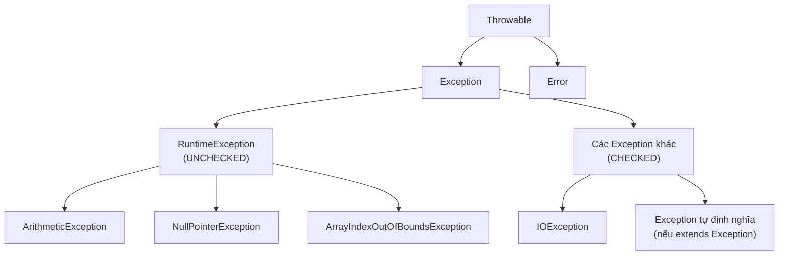

# Chương 21 — Exception handling

## Mục tiêu học

Sau chương này, bạn sẽ:

- Dùng `try/catch/finally` để bắt và xử lý lỗi runtime, thay vì để chương trình crash đột ngột.
- Phân biệt **checked exception** và **unchecked exception**, hiểu vì sao Java tách biệt hai loại.
- Tạo được exception tự định nghĩa (custom exception) cho lỗi nghiệp vụ riêng của chương trình.
- Dùng `try-with-resources` để tự động giải phóng tài nguyên đúng cách.

Code mẫu đầy đủ: [`code/ch21-exception-handling/`](../../code/ch21-exception-handling/).

## Exception là gì, vì sao cần xử lý?

Từ các chương trước, bạn đã nhiều lần gặp chương trình "crash" giữa chừng: `ArrayIndexOutOfBoundsException`
(Chương 9), `NullPointerException` (Chương 13), `ClassCastException` (Chương 17)... Khi những lỗi
này xảy ra mà không được xử lý, JVM in ra "stack trace" (dấu vết lỗi) rồi **dừng chương trình ngay
lập tức**. Với chương trình thực tế (ví dụ server chạy liên tục phục vụ nhiều người dùng), để một
lỗi nhỏ làm sập toàn bộ chương trình là không chấp nhận được — **exception handling** là cơ chế cho
phép bạn "bắt" những lỗi này và quyết định cách phản ứng phù hợp, thay vì để chương trình chết.

## `try / catch` cơ bản

```java
try {
    int ketQua = 10 / 0; // gay ra ArithmeticException
    System.out.println("Khong bao gio in ra dong nay");
} catch (ArithmeticException e) {
    System.out.println("Bat duoc loi: " + e.getMessage());
}
```

- Code có khả năng gây lỗi đặt trong khối `try`.
- Nếu lỗi xảy ra, Java **lập tức nhảy** ra khỏi khối `try` (mọi dòng code sau chỗ gây lỗi trong
  `try`, kể cả khi chưa lỗi, **không chạy nữa**), tìm khối `catch` phù hợp với **loại** lỗi đã xảy
  ra.
- `e` là object exception, chứa thông tin về lỗi — `e.getMessage()` lấy thông điệp mô tả lỗi.
- Nếu **không có** lỗi nào xảy ra trong `try`, mọi khối `catch` bị bỏ qua hoàn toàn, chương trình
  chạy tiếp bình thường sau `try/catch`.

## `finally` — luôn chạy, dù có lỗi hay không

```java
try {
    System.out.println("Dang thu...");
    int[] mang = new int[3];
    System.out.println(mang[5]);
} catch (ArrayIndexOutOfBoundsException e) {
    System.out.println("Bat duoc loi truy cap mang: " + e.getMessage());
} finally {
    System.out.println("Khoi finally LUON chay, bat ke co loi hay khong");
}
```

Khối `finally` (tuỳ chọn) **luôn được thực thi**, bất kể `try` có ném lỗi hay không, và bất kể lỗi
đó có được `catch` bắt được hay không. Dùng `finally` cho các thao tác **bắt buộc phải làm** dù kết
quả ra sao — ví dụ đóng kết nối, giải phóng tài nguyên (dù từ Java 7 trở đi,
`try-with-resources` — xem phần dưới — thường là lựa chọn tốt hơn `finally` cho đúng mục đích này).

## Bắt nhiều loại lỗi — multi-catch

```java
try {
    int soNguyen = Integer.parseInt(s);
} catch (NumberFormatException | NullPointerException e) {
    System.out.println("Loi: " + e.getClass().getSimpleName());
}
```

Dấu `|` cho phép **một khối `catch` xử lý nhiều loại exception** giống hệt nhau, tránh viết lặp lại
nhiều khối `catch` có nội dung xử lý giống nhau. Chỉ dùng được khi các loại lỗi đó **không có quan
hệ cha-con** với nhau (nếu có, chỉ cần bắt loại cha là đủ — xem phần thứ tự `catch` bên dưới).

### Thứ tự các khối `catch` quan trọng

Nếu bắt nhiều loại lỗi có quan hệ kế thừa (Chương 16-17), khối `catch` cho lớp **con** (cụ thể hơn)
phải đặt **trước** khối `catch` cho lớp **cha** (chung chung hơn) — nếu đặt ngược lại, khối `catch`
lớp cha sẽ "bắt hết" trước khi khối con có cơ hội chạy, và trình biên dịch **báo lỗi** vì phát hiện
khối `catch` con sẽ không bao giờ chạy tới được (`unreachable catch block`).

## Checked exception vs Unchecked exception

Đây là khái niệm quan trọng và **riêng có của Java** so với nhiều ngôn ngữ khác:



- **Unchecked exception** — kế thừa từ `RuntimeException` (như `ArithmeticException`,
  `NullPointerException`, `ArrayIndexOutOfBoundsException` bạn đã gặp). Trình biên dịch **không bắt
  buộc** bạn phải `try/catch` hay khai báo gì — chương trình vẫn biên dịch được dù không xử lý.
  Thường đại diện cho **lỗi lập trình** (bug) — về nguyên tắc nên sửa code để lỗi không xảy ra, hơn
  là "che" nó bằng `try/catch`.
- **Checked exception** — kế thừa trực tiếp từ `Exception` nhưng **không** qua `RuntimeException`
  (như `IOException` sẽ gặp ở Chương 34). Trình biên dịch **bắt buộc** bạn phải `try/catch`, hoặc
  khai báo `throws` để "đẩy trách nhiệm xử lý lên" nơi gọi nó — không làm gì cả sẽ là **lỗi biên
  dịch**. Thường đại diện cho **tình huống có thể lường trước** trong hoạt động bình thường của
  chương trình (file không tồn tại, kết nối mạng mất...), buộc lập trình viên phải chủ động quyết
  định xử lý ra sao.

## Tự định nghĩa exception (custom exception)

```java
public class SoDuKhongDuException extends Exception {
    private double soThieu;

    public SoDuKhongDuException(String thongDiep, double soThieu) {
        super(thongDiep);
        this.soThieu = soThieu;
    }

    public double getSoThieu() {
        return soThieu;
    }
}
```

`extends Exception` (không phải `RuntimeException`) tạo ra một **checked exception mới**, đại diện
cho một lỗi **nghiệp vụ** riêng của chương trình bạn — ở đây: rút tiền vượt quá số dư. Dùng
`throw` để **chủ động ném lỗi** khi phát hiện tình huống không hợp lệ:

```java
public void rutTien(double soTien) throws SoDuKhongDuException {
    if (soTien > soDu) {
        throw new SoDuKhongDuException("Khong du so du", soTien - soDu);
    }
    soDu -= soTien;
}
```

`throws SoDuKhongDuException` trong chữ ký phương thức là **bắt buộc** vì đây là checked exception —
mọi nơi gọi `rutTien(...)` buộc phải `try/catch` nó, hoặc tự khai báo `throws` tiếp lên trên.

**So sánh với cách tiếp cận ở Chương 14** (`TaiKhoanNganHang.napTien`/`rutTien` chỉ in cảnh báo và
`return` khi dữ liệu không hợp lệ): dùng exception (như chương này) buộc nơi gọi **phải chủ động
quyết định** cách xử lý lỗi (không có cách nào "vô tình bỏ qua" lỗi mà không biết), trong khi cách
in cảnh báo + `return` ở Chương 14 dễ bị bỏ sót nếu người gọi không kiểm tra kỹ. Với lỗi nghiệp vụ
quan trọng, dùng exception thường là lựa chọn chắc chắn hơn.

## `try-with-resources` — tự động giải phóng tài nguyên

```java
try (NguonTaiNguyen tn = new NguonTaiNguyen("file.txt")) {
    tn.doc();
} // 'tn.close()' TU DONG duoc goi o day, KE CA khi co exception xay ra ben trong try
```

Bất kỳ class nào `implements AutoCloseable` (chỉ có một phương thức `close()`) đều dùng được trong
cú pháp `try (...)` này. Java **tự động gọi `close()`** ngay khi ra khỏi khối `try` — dù thoát bình
thường hay do exception — bạn không cần tự viết `finally { tn.close(); }` thủ công nữa. Đây là cách
an toàn và ngắn gọn nhất để đảm bảo tài nguyên (file, kết nối mạng, kết nối database...) luôn được
giải phóng đúng cách; sẽ dùng lại rất nhiều ở Chương 34 (File I/O) trở đi.

## Bài tập

1. Viết custom checked exception `TuoiKhongHopLeException`, dùng nó trong một phương thức
   `setTuoi(int tuoi)` (tương tự bài tập Chương 14) — thay vì chỉ in cảnh báo, `throw` exception khi
   `tuoi < 0`.
2. Viết vòng lặp thử `rutTien` nhiều lần với các giá trị khác nhau (có hợp lệ, có không), dùng
   `try/catch` để chương trình **tiếp tục chạy** sau mỗi lần rút thất bại thay vì dừng hẳn.
3. Tạo một class `AutoCloseable` khác (ví dụ mô phỏng kết nối database), dùng trong
   `try-with-resources` với **hai** resource cùng lúc (`try (A a = ...; B b = ...) { ... }`), quan
   sát thứ tự `close()` được gọi (gợi ý: thứ tự ngược lại với thứ tự mở).

## Lỗi thường gặp

- **Bắt exception quá chung chung** (`catch (Exception e)`) **rồi không làm gì cả** (khối `catch`
  rỗng) — lỗi bị "nuốt" hoàn toàn, chương trình chạy tiếp với trạng thái sai mà không có dấu vết gì
  để debug sau này. Ít nhất nên in ra thông tin lỗi (`e.printStackTrace()` hoặc log — sẽ học logging
  đúng cách ở Chương 43).
- **Đặt khối `catch` cho lớp cha trước lớp con** — lỗi biên dịch `unreachable catch block`. Luôn
  đặt `catch` cụ thể nhất lên trước.
- **Quên khai báo `throws` (hoặc quên `try/catch`) khi gọi phương thức ném checked exception** —
  lỗi biên dịch `unhandled exception`. Đây là hành vi **cố ý** của Java, không phải bug — nhắc bạn
  phải xử lý tình huống đó.
- **Dùng exception để điều khiển luồng chương trình bình thường** (ví dụ dùng exception thay cho
  `if` để kiểm tra điều kiện thông thường) — exception có chi phí hiệu năng cao hơn nhiều so với
  `if/else` thông thường, và làm code khó đọc. Chỉ dùng exception cho tình huống **thực sự bất
  thường**, không phải luồng logic chính.
- **Quên rằng `finally` chạy cả khi có `return` trong `try`/`catch`** — nếu `finally` cũng có
  `return`, giá trị trả về của `finally` sẽ **ghi đè** giá trị trả về dự định trong `try`/`catch` —
  đây là nguồn lỗi khó hiểu, tốt nhất tránh đặt `return` trong khối `finally`.
