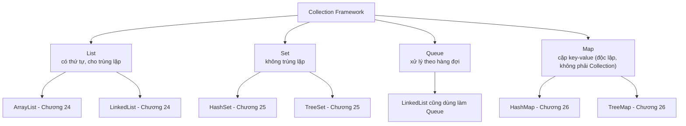

# Chương 23 — Tổng quan Collection Framework

## Mục tiêu học

Sau chương này, bạn sẽ:

- Hiểu Collection Framework là gì, vì sao nó ra đời để thay thế mảng trong nhiều trường hợp.
- Biết 4 nhóm cấu trúc dữ liệu chính: `List`, `Set`, `Map`, `Queue` — khác nhau ở điểm nào.
- Có bức tranh tổng quan để chọn đúng cấu trúc cho từng bài toán, trước khi học sâu từng loại ở
  các chương tiếp theo.

Code mẫu đầy đủ: [`code/ch23-tong-quan-collection/`](../../code/ch23-tong-quan-collection/).

## Vì sao cần Collection Framework, mảng chưa đủ sao?

Nhắc lại hạn chế của mảng đã học ở Chương 9: **kích thước cố định** (không thêm/bớt phần tử động
được), không có sẵn thao tác tìm kiếm/loại trùng lặp/sắp xếp theo key... Bạn phải tự viết tay mọi
logic đó nếu chỉ dùng mảng thuần. **Collection Framework** là tập hợp các cấu trúc dữ liệu chuẩn có
sẵn trong `java.util`, đã được tối ưu và kiểm chứng kỹ lưỡng, giải quyết đúng những hạn chế đó.

## Bốn nhóm chính

- **`List`** — dãy phần tử **có thứ tự** (index từ 0, giống mảng nhưng kích thước động), **cho
  phép phần tử trùng lặp**. Dùng khi thứ tự và số lần xuất hiện đều quan trọng — ví dụ danh sách
  công việc theo thứ tự nhập vào.
- **`Set`** — tập hợp **không cho phần tử trùng lặp** (thêm phần tử đã tồn tại sẽ bị bỏ qua âm
  thầm, không báo lỗi). Dùng khi bạn chỉ quan tâm "có mặt hay không", không quan tâm số lần/thứ tự
  — ví dụ tập hợp các mã số sinh viên đã điểm danh.
- **`Map`** — lưu trữ theo **cặp key-value**, mỗi key là duy nhất (gán giá trị mới cho key đã tồn
  tại sẽ **ghi đè**, không tạo thêm bản ghi). Dùng khi bạn cần tra cứu nhanh giá trị dựa trên một
  khoá — ví dụ tra điểm một môn học dựa trên tên môn.
- **`Queue`** — hàng đợi, mặc định xử lý theo nguyên tắc **vào trước ra trước** (FIFO — First In
  First Out), giống hàng người xếp hàng thật. Dùng khi cần xử lý các phần tử **theo đúng thứ tự
  chúng được thêm vào**, và loại bỏ dần sau khi xử lý — ví dụ hàng đợi in tài liệu, hàng đợi tác vụ
  cần xử lý.

**Lưu ý về mặt kỹ thuật**: `Map` **không** kế thừa từ interface `Collection` chung (khác với
`List`/`Set`/`Queue`) vì bản chất nó lưu **cặp** dữ liệu, không phải **từng phần tử đơn lẻ** — nhưng
về mặt khái niệm, `Map` vẫn thuộc "họ" Collection Framework và luôn được nhắc tới cùng nhóm.

## Bảng chọn nhanh cấu trúc dữ liệu

| Cần gì? | Chọn |
|---|---|
| Danh sách có thứ tự, cho phép trùng lặp, hay thêm/bớt ở giữa | `ArrayList` hoặc `LinkedList` (Chương 24) |
| Tập hợp không trùng lặp, không cần thứ tự cụ thể | `HashSet` (Chương 25) |
| Tập hợp không trùng lặp, cần tự động sắp xếp | `TreeSet` (Chương 25) |
| Tra cứu nhanh theo khoá | `HashMap` (Chương 26) |
| Tra cứu theo khoá, cần khoá luôn được sắp xếp | `TreeMap` (Chương 26) |
| Xử lý tuần tự theo hàng đợi (vào trước ra trước) | `LinkedList` (dùng qua interface `Queue`) |

Bảng này sẽ trở nên cụ thể và dễ hiểu hơn nhiều sau khi bạn học chi tiết từng cấu trúc ở các chương
tiếp theo — hãy quay lại đọc bảng này lần nữa sau khi học xong Chương 24-26.

## Cùng một tinh thần generics đã học ở Chương 22

Mọi cấu trúc trong Collection Framework đều dùng generics: `List<String>`, `Map<String, Integer>`...
— tham số kiểu (`<String>`, `<String, Integer>`) khai báo rõ collection này chứa đúng kiểu gì, giúp
trình biên dịch bắt lỗi kiểu ngay lúc biên dịch thay vì phải ép kiểu thủ công như thời trước Java 5
(khi Collection Framework còn dùng `Object` thuần).

## Bài tập

1. Không cần code, chỉ cần trả lời: bạn sẽ chọn cấu trúc dữ liệu nào để lưu (a) danh sách các bài
   hát trong một playlist (có thể trùng tên bài hát, thứ tự phát quan trọng), (b) tập hợp các email
   đã đăng ký (không được trùng), (c) tra cứu giá sản phẩm theo mã sản phẩm?
2. Chạy `CollectionOverviewDemo.java`, thử thêm một phần tử trùng lặp vào `Set` và quan sát
   `tapMon.size()` không tăng lên.
3. Thử đổi `diemMon.put("Toan", 10);` thành một key mới hoàn toàn (`"Ly"`), chạy lại và quan sát
   `Map` giờ có 3 cặp thay vì 2.

## Lỗi thường gặp

- **Dùng `List` khi thực ra chỉ cần kiểm tra "có tồn tại hay không"** — dùng `Set` sẽ hiệu quả hơn
  nhiều cho thao tác kiểm tra tồn tại (sẽ thấy rõ khác biệt hiệu năng ở Chương 25).
- **Tưởng `Map` cũng là một dạng `Collection` giống `List`/`Set`** — về mặt kỹ thuật `Map` là
  interface riêng, không kế thừa `Collection`. Chi tiết này ít khi gây lỗi thực tế nhưng hay bị hỏi
  nhầm khi mới học.
- **Kỳ vọng `Set` giữ đúng thứ tự đã thêm vào** — `HashSet` (loại `Set` phổ biến nhất) **không đảm
  bảo thứ tự** — sẽ giải thích rõ lý do kỹ thuật ở Chương 25, cùng với `LinkedHashSet` (biến thể có
  giữ thứ tự) nếu cần.
