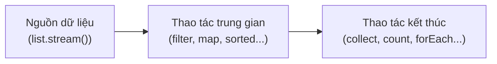

# Chương 31 — Stream API

## Mục tiêu học

Sau chương này, bạn sẽ:

- Hiểu Stream là gì, khác gì so với `Collection` (Chương 23).
- Dùng thành thạo các thao tác trung gian phổ biến: `filter`, `map`, `sorted`.
- Dùng các thao tác kết thúc: `collect`, `count`, `anyMatch`/`allMatch`, `findFirst`, `reduce`.
- Dùng `Collectors` để gom kết quả thành `List`, `Map`, hoặc nhóm theo tiêu chí (`groupingBy`).

Code mẫu đầy đủ: [`code/ch31-stream-api/`](../../code/ch31-stream-api/).

## Stream là gì?

```java
List<String> tenDaiCu = new ArrayList<>();
for (String t : ten) {
    if (t.length() > 5) {
        tenDaiCu.add(t.toUpperCase());
    }
}
```

Đây là mẫu code rất quen thuộc: lọc phần tử theo điều kiện, biến đổi từng phần tử, gom kết quả lại.
**Stream** (Java 8+) cung cấp một cách viết **khai báo (declarative)** cho đúng loại thao tác này —
mô tả **"muốn gì"** thay vì viết từng bước **"làm thế nào"**:

```java
List<String> tenDaiMoi = ten.stream()
    .filter(t -> t.length() > 5)
    .map(String::toUpperCase)
    .collect(Collectors.toList());
```

Đọc gần như tiếng Anh: "lấy stream từ `ten`, lọc giữ lại phần tử dài hơn 5, biến đổi thành chữ hoa,
gom lại thành một `List`". **Stream không phải là một cấu trúc dữ liệu** (khác `List`/`Set`/`Map`
đã học ở Phần 5) — nó là một "đường ống xử lý" tạm thời, chạy qua dữ liệu từ một nguồn (thường là
một `Collection` có sẵn) rồi biến mất, **không lưu trữ gì lâu dài** và **không sửa đổi** nguồn dữ
liệu gốc.

## Ba phần của một pipeline Stream



1. **Nguồn** — thường gọi `.stream()` trên một `Collection` có sẵn.
2. **Thao tác trung gian (intermediate)** — trả về **một Stream khác**, có thể **nối tiếp** nhiều
   thao tác liên tục (gọi là "chaining"). Không thực sự chạy ngay — Stream có tính chất **lazy**
   (lười biếng): các thao tác trung gian chỉ thực sự thực thi khi có một thao tác kết thúc được gọi.
3. **Thao tác kết thúc (terminal)** — trả về **một kết quả cụ thể** (không còn là Stream nữa), và
   **kích hoạt** toàn bộ pipeline chạy. Sau khi gọi một thao tác kết thúc, Stream đó **không dùng
   lại được nữa** (gọi thêm thao tác trên cùng Stream đó sẽ ném lỗi).

## Thao tác trung gian phổ biến

```java
.filter(t -> t.length() > 5)     // giu lai phan tu THOA DIEU KIEN (Predicate, Chuong 30)
.map(String::toUpperCase)         // BIEN DOI tung phan tu thanh gia tri khac (Function, Chuong 30)
.sorted()                         // sap xep theo thu tu tu nhien (hoac truyen Comparator)
```

`filter` nhận một `Predicate<T>`, `map` nhận một `Function<T, R>` — đây chính xác là các
functional interface đã học ở Chương 30, được dùng làm "tham số cấu hình" cho từng bước xử lý của
Stream.

## Thao tác kết thúc phổ biến

```java
.collect(Collectors.toList())      // gom thanh List
.count()                            // dem so luong phan tu con lai sau cac buoc loc
.anyMatch(t -> t.startsWith("A"))   // co IT NHAT MOT phan tu thoa dieu kien khong?
.allMatch(t -> t.length() > 2)      // TAT CA phan tu deu thoa dieu kien khong?
.findFirst()                        // lay phan tu DAU TIEN con lai, tra ve Optional (Chuong 32)
```

## `reduce()` — gộp toàn bộ Stream thành một giá trị

```java
double tongGiaTri = danhSach.stream()
    .map(SanPham::getGia)
    .reduce(0.0, Double::sum);
```

`reduce(giaTriKhoiDau, hamGop)` áp dụng `hamGop` liên tiếp lên **giá trị đang tích luỹ** và **từng
phần tử tiếp theo**, bắt đầu từ `giaTriKhoiDau`. Về bản chất, `reduce` **tương đương** một vòng lặp
tích luỹ bạn đã viết tay nhiều lần trong sách này:

```java
double tong = 0.0;
for (SanPham sp : danhSach) {
    tong = Double.sum(tong, sp.getGia()); // tuong duong tong = tong + sp.getGia()
}
```

## `Collectors` — các cách gom kết quả phổ biến

```java
Collectors.toList()                              // gom thanh List
Collectors.toMap(SanPham::getTen, SanPham::getGia) // gom thanh Map (key -> value)
Collectors.groupingBy(SanPham::getLoai)           // nhom thanh Map<Loai, List<SanPham>>
Collectors.groupingBy(SanPham::getLoai, Collectors.summingDouble(SanPham::getGia)) // nhom + tinh tong tung nhom
Collectors.joining(", ")                          // noi cac String lai, cach nhau boi dau phan cach
```

`groupingBy` đặc biệt hữu ích: chỉ với một dòng, thay thế hoàn toàn khối code thủ công (tạo `Map`,
kiểm tra key tồn tại, khởi tạo `List` mới cho key lần đầu, thêm phần tử...) mà bạn từng phải tự viết
ở bài tập Chương 26.

## Khi nào nên dùng Stream, khi nào nên dùng vòng lặp thường?

Stream **không thay thế hoàn toàn** vòng lặp `for`/`for-each` — cả hai đều là công cụ hợp lệ:

- **Ưu tiên Stream** khi thao tác là "lọc - biến đổi - gom kết quả" theo kiểu tuyến tính, không có
  logic điều khiển phức tạp (không cần `break` giữa chừng, không có nhiều nhánh rẽ phụ thuộc lẫn
  nhau) — Stream thường đọc rõ ràng và ngắn gọn hơn nhiều trong các trường hợp này.
- **Ưu tiên vòng lặp thường** khi logic phức tạp, cần `break`/`continue` có điều kiện phức tạp, cần
  cập nhật nhiều biến cùng lúc theo cách không tự nhiên với mô hình "biến đổi tuần tự" — cố ép logic
  phức tạp vào Stream nhiều khi làm code **khó đọc hơn**, phản tác dụng.

## Bài tập

1. Dùng Stream tính tổng bình phương của các số chẵn trong một `List<Integer>`
   (`filter` → `map` → `reduce`, hoặc dùng `mapToInt(...).sum()`).
2. Dùng `Collectors.groupingBy` nhóm một `List<NguoiDung>` (tương tự Chương 27) theo độ tuổi chẵn
   hay lẻ (key là `"chan"`/`"le"`, tự viết một `Function` trả về chuỗi đó dựa trên `getTuoi() % 2`).
3. Viết lại bài toán "đếm số lần xuất hiện" đã làm ở Chương 26 (dùng `Map`/`merge`) bằng Stream, sử
   dụng `Collectors.groupingBy(tu -> tu, Collectors.counting())`.

## Lỗi thường gặp

- **Dùng lại một Stream đã gọi thao tác kết thúc** — ném `IllegalStateException`
  (`stream has already been operated upon or closed`). Mỗi Stream chỉ dùng được **một lần**; cần
  gọi lại `.stream()` từ nguồn nếu muốn xử lý lại.
- **Tưởng `filter`/`map` sửa danh sách gốc** — Stream **không bao giờ** sửa nguồn dữ liệu ban đầu,
  luôn tạo ra kết quả **mới** qua thao tác kết thúc (`collect`). Danh sách gốc (`ten` trong ví dụ
  trên) luôn giữ nguyên.
- **Viết pipeline Stream quá dài, quá nhiều bước lồng nhau, khó đọc hơn cả vòng lặp thường** — nếu
  một pipeline Stream cần đọc đi đọc lại nhiều lần mới hiểu, đó là dấu hiệu nên tách thành các bước
  nhỏ hơn (gán kết quả trung gian cho biến có tên rõ ràng), hoặc quay lại dùng vòng lặp thường nếu
  hợp lý hơn.
- **Gọi thao tác kết thúc mà quên gán/dùng kết quả trả về** — ví dụ chỉ viết
  `danhSach.stream().filter(...)` một mình (thiếu thao tác kết thúc) — do tính chất "lazy", dòng
  này **không làm gì cả**, không có lỗi biên dịch/runtime, chỉ đơn giản là vô nghĩa. Luôn kết thúc
  pipeline bằng một thao tác kết thúc và dùng kết quả của nó.
