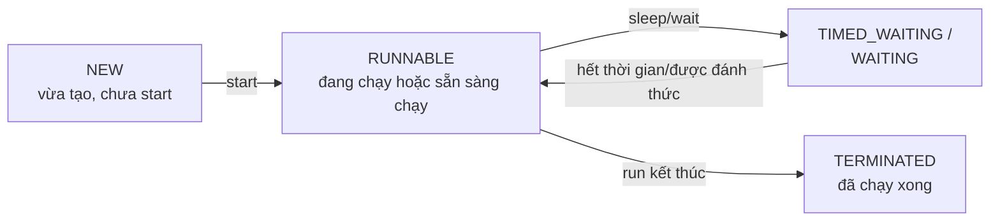

# Chương 37 — Thread cơ bản

## Mục tiêu học

Sau chương này, bạn sẽ:

- Hiểu thread (luồng) là gì, vì sao cần lập trình đa luồng.
- Tạo thread bằng hai cách: `extends Thread` và `implements Runnable`, biết cách nào nên dùng hơn.
- Hiểu vòng đời của thread, dùng `start()`, `join()`, `sleep()` đúng cách.
- Hiểu thứ tự chạy giữa các thread độc lập **không được đảm bảo**, và vì sao điều đó quan trọng.

Code mẫu đầy đủ: [`code/ch37-thread-co-ban/`](../../code/ch37-thread-co-ban/).

## Thread là gì?

Mọi chương trình từ đầu sách đến giờ chạy theo **một luồng duy nhất** (single-threaded) — các câu
lệnh thực thi tuần tự, từng dòng một, chỉ có một "việc" diễn ra tại một thời điểm. **Thread**
(luồng) là một "đường chạy" độc lập của chương trình — một chương trình có thể có **nhiều thread
chạy song song** (đồng thời, hoặc xen kẽ rất nhanh nếu máy chỉ có một lõi CPU), mỗi thread thực
hiện một công việc riêng, không phải đợi thread khác làm xong mới bắt đầu.

Dùng đa luồng khi cần: xử lý nhiều việc **độc lập** cùng lúc (ví dụ vừa tải dữ liệu từ mạng, vừa
giữ giao diện phản hồi được với người dùng), hoặc tận dụng **nhiều lõi CPU** để tính toán nhanh hơn
bằng cách chia nhỏ công việc.

## Cách 1: `extends Thread`

```java
class DemSo extends Thread {
    @Override
    public void run() {
        for (int i = 1; i <= 3; i++) {
            System.out.println("dem: " + i);
        }
    }
}

DemSo t = new DemSo();
t.start(); // KHONG goi t.run() truc tiep!
```

Override `run()` — đây là nơi chứa code sẽ chạy **trên thread mới**. **Điểm quan trọng nhất cần
nhớ**: gọi `t.start()` để **thực sự bắt đầu chạy trên một thread mới**; nếu bạn vô tình gọi
`t.run()` trực tiếp (như gọi một phương thức bình thường), code vẫn chạy, nhưng chạy **trên chính
thread hiện tại** (thường là `main`), **không** tạo thread mới nào cả — mất hoàn toàn ý nghĩa của
việc dùng Thread.

## Cách 2: `implements Runnable` — được khuyến dùng hơn

```java
class TacVu implements Runnable {
    @Override
    public void run() {
        System.out.println("Dang chay...");
    }
}

Thread t = new Thread(new TacVu());
t.start();
```

Thay vì `extends Thread` trực tiếp, tạo một class `implements Runnable` (chỉ định nghĩa **công
việc cần làm**), rồi truyền nó vào constructor của `Thread`. Lý do cách này được khuyến dùng hơn:
nhắc lại Chương 16, Java **không hỗ trợ đa kế thừa class** — nếu class của bạn đã `extends Thread`,
nó **không còn "chỗ trống"** để `extends` thêm bất kỳ class nào khác nếu sau này cần. Dùng
`implements Runnable` giữ được sự linh hoạt đó, vì một class `implements` được nhiều interface
(Chương 18).

### Viết gọn hơn bằng lambda (Chương 30)

```java
Thread t = new Thread(() -> {
    System.out.println("Dang chay...");
});
```

`Runnable` chỉ có **đúng một** phương thức abstract (`run()`) — đây chính xác là một functional
interface (Chương 30), nên dùng lambda thay cho việc tự viết hẳn một class riêng là cách viết phổ
biến nhất trong code Java hiện đại.

## Vòng đời của Thread



`Thread.getState()` cho biết trạng thái hiện tại. Vài trạng thái quan trọng:

- **`NEW`** — object `Thread` đã tạo (`new Thread(...)`) nhưng **chưa** gọi `start()`.
- **`RUNNABLE`** — đã `start()`, đang chạy hoặc sẵn sàng được CPU cấp thời gian chạy.
- **`TIMED_WAITING`** — đang tạm dừng có thời hạn, ví dụ đang trong `Thread.sleep(...)`.
- **`TERMINATED`** — `run()` đã chạy xong hoàn toàn (hoặc kết thúc do lỗi không bắt được).

## `join()` — chờ một thread khác chạy xong

```java
t1.start();
t2.start();
t1.join(); // main DUNG LAI o day, cho t1 chay xong HOAN TOAN
t2.join(); // roi cho t2 chay xong HOAN TOAN
System.out.println("Ca hai da xong");
```

Nếu **không** gọi `join()`, thread gọi `start()` (thường là `main`) tiếp tục chạy ngay lập tức,
**không đợi** thread mới tạo chạy xong — chương trình có thể kết thúc (hoặc `main` chạy tới dòng in
kết quả) **trước khi** thread mới kịp làm xong việc. `join()` chặn thread hiện tại lại cho tới khi
thread được gọi `join()` chuyển sang `TERMINATED`.

## `Thread.sleep(...)` — tạm dừng có thời hạn

```java
Thread.sleep(1000); // tam dung thread NAY 1000 mili-giay (1 giay)
```

`sleep` chỉ tạm dừng **thread đang gọi nó** — các thread khác (kể cả `main`, nếu gọi `sleep` từ một
thread con) không bị ảnh hưởng, vẫn chạy bình thường. `sleep` ném `InterruptedException` (checked
exception, Chương 21) nếu thread bị "đánh thức sớm" một cách chủ động từ bên ngoài — cần
`try/catch` khi gọi.

## Thứ tự chạy giữa các thread KHÔNG được đảm bảo

```java
Thread a = new Thread(() -> System.out.println("A"));
Thread b = new Thread(() -> System.out.println("B"));
a.start();
b.start();
```

Đây là điều **quan trọng nhất** cần khắc sâu ở chương này: sau khi cả hai thread `start()`, **không
có gì đảm bảo** `a` sẽ in "A" trước khi `b` in "B" — hệ điều hành quyết định thứ tự cấp thời gian
chạy cho từng thread, có thể khác nhau **mỗi lần chạy chương trình**, thậm chí trên cùng một máy.
Chạy `ThreadLifecycleDemo.java` vài lần để tự quan sát thứ tự "A"/"B" thay đổi giữa các lần chạy.
Đây chính là nguồn gốc của nhiều lỗi đa luồng tinh vi — Chương 38 sẽ học cách xử lý khi nhiều thread
cùng truy cập chung một dữ liệu, nơi thứ tự không đảm bảo này thực sự gây ra sai lệch dữ liệu.

## Bài tập

1. Tạo 5 thread (dùng `Runnable` + lambda), mỗi thread in ra số thứ tự của nó (`0` đến `4`), chạy
   chương trình nhiều lần và quan sát thứ tự in ra không cố định.
2. Viết chương trình dùng `Thread.sleep` để mô phỏng "tải dữ liệu" mất 2 giây trên một thread riêng,
   trong khi `main` in ra "Đang xử lý..." mỗi 500ms cho tới khi thread tải xong (gợi ý: dùng vòng
   lặp kiểm tra `thread.isAlive()`).
3. So sánh thời gian chạy: tính tổng bình phương các số từ 1 đến 10.000.000 bằng (a) một vòng lặp
   đơn giản, (b) chia thành 2 thread mỗi thread xử lý một nửa dãy số rồi cộng kết quả lại (dùng
   `join()` để chờ cả hai xong). Trên máy nhiều lõi, cách (b) có thể nhanh hơn.

## Lỗi thường gặp

- **Gọi `t.run()` thay vì `t.start()`** — chạy trên thread hiện tại, không tạo thread mới, mất hoàn
  toàn ý nghĩa đa luồng. Đây là lỗi rất phổ biến với người mới, vì cả hai đều biên dịch được bình
  thường, không có cảnh báo.
- **Quên `join()`, chương trình kết thúc trước khi thread con làm xong việc** — với chương trình
  console đơn giản, `main` kết thúc kéo theo toàn bộ tiến trình JVM kết thúc, thread con có thể bị
  "cắt ngang" nếu chưa kịp chạy xong (thread không phải "daemon" mặc định thì JVM sẽ đợi, nhưng để
  chắc chắn về thứ tự hoàn thành, luôn dùng `join()` tường minh nếu cần).
- **Gọi `start()` hai lần trên cùng một object `Thread`** — ném `IllegalThreadStateException`. Mỗi
  object `Thread` chỉ chạy được **đúng một lần**; cần tạo object `Thread` mới nếu muốn chạy lại.
- **Giả định thứ tự chạy giữa các thread độc lập** (viết logic phụ thuộc vào việc "thread A luôn in
  trước thread B") — không đảm bảo, có thể chạy đúng "tình cờ" trên máy bạn nhưng sai trên máy khác
  hoặc lần chạy khác. Nếu cần đảm bảo thứ tự, phải dùng cơ chế đồng bộ hoá (Chương 38) hoặc `join()`
  đúng chỗ.
